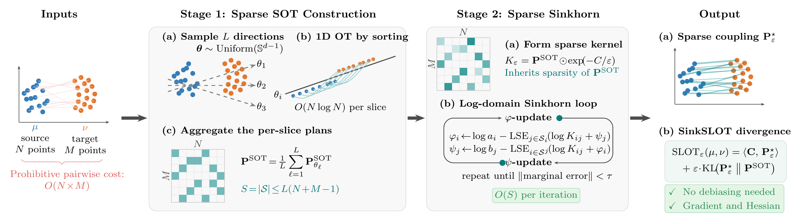

<p align="center">
  
</p>

# SinkSLOT

SinkSLOT computes entropic optimal transport (EOT) using a sparse sliced
lifted plan as the reference measure, instead of the usual independent
product `a ⊗ b`. Restricting each Sinkhorn iteration to that plan's support
reduces the per-iteration cost from `O(N²)` to `O(LN)`, where `L` is the
number of random slicing directions.

The resulting objective, SLOT, is a divergence: SLOT(x, x) = 0, so it
needs no debiasing.

On CUDA, `backend="auto"` (the default) uses the fused Triton kernels when
Triton is installed; otherwise, and always on CPU, SinkSLOT automatically
falls back to plain PyTorch, running the same algorithm just without the
fused-kernel throughput.

## Install

This repo isn't published to PyPI; install from source:

```bash
git clone https://github.com/cai4cai/SinkSLOT
cd SinkSLOT
pip install -e .
```

**Requirements:** PyTorch >= 2.5. Triton >= 3.1 is optional
(`pip install -e ".[triton]"`) for the fused Triton/CUDA kernels. Without
it, SinkSLOT runs the pure-torch fallback automatically.

## Tensor Contract

- `x`: `(N, d)` floating tensor, the source point cloud.
- `y`: `(M, d)` floating tensor, the target point cloud.
- `a`: `(N,)` nonnegative weights, the source marginal. Uniform if omitted
  (`SamplesLoss`, `sparse_transport_plan`); `sinkslot_solve` requires it.
- `b`: `(M,)` nonnegative weights, the target marginal. Same as `a`.

`x`, `y`, `a`, `b` must all share the same dtype and device. `a`/`b` are
used exactly as given, not normalized; `sum(a)` must equal `sum(b)`, which
is checked and raises `ValueError` on mismatch. Zero entries are legal.

Ground cost is squared Euclidean, $C_{ij} = \|x_i - y_j\|^2$, which sets
the scale `eps` is measured against.

`seed` controls the random slicing directions: the same `(x.shape[-1], L,
seed)` always gives the same directions, from a generator local to that
call, independent of global PyTorch RNG state or any prior call.

| | Supported |
|---|---|
| `N != M` | Yes |
| `float32` | Yes, on every backend |
| `float64` | Yes on `backend="torch"`. No on `backend="triton"`, raises `ValueError`: the Triton kernels are float32-only |
| CPU | Yes. `backend="auto"` (the default) resolves to `torch`; Triton requires CUDA |
| CUDA | Yes. `backend="auto"` (the default) picks `triton` when installed, `torch` otherwise |

## Basic Usage

The quickest way to call SinkSLOT is `sinkslot.SamplesLoss`, a
[GeomLoss](https://www.kernel-operations.io/geomloss/)-style callable loss
module.

### SamplesLoss

```python
import torch
from sinkslot import SamplesLoss

device = "cuda" if torch.cuda.is_available() else "cpu"
x = torch.randn(10000, 2, requires_grad=True, device=device)
y = torch.randn(10000, 2, device=device)

loss = SamplesLoss(eps=0.05, L=64, n_iters=200)
cost = loss(x, y)                          # achieved SLOT_eps divergence (primal value)
grad_x, = torch.autograd.grad(cost, [x])   # analytic gradient, no backprop through Sinkhorn
phi, psi = loss(x, y, potentials=True)     # dual potentials
```

### Gradient Flow

An explicit gradient-descent loop works either through `autograd`
(`SamplesLoss`) or directly via `slot_grad`: same analytic gradient either
way, the loops differ only in how `grad` gets computed.

<table>
<tr><th>autograd</th><th>slot_grad</th></tr>
<tr>
<td>

```diff
 device = "cuda" if torch.cuda.is_available() else "cpu"
 n = 1000
 x = torch.randn(n, 2, device=device)
 y = torch.randn(n, 2, device=device) + 3.0
 a = torch.full((n,), 1.0 / n, device=device)
 b = torch.full((n,), 1.0 / n, device=device)
 loss = SamplesLoss(eps=0.01, L=100, n_iters=200)

 lr = 0.1
 for step in range(200):
     x = x.detach().requires_grad_(True)
     cost = loss(x, y, a, b)
+    grad, = torch.autograd.grad(cost, [x])
     x = x - lr * grad
```

</td>
<td>

```diff
 from sinkslot import slot_grad

 device = "cuda" if torch.cuda.is_available() else "cpu"
 n = 1000
 x = torch.randn(n, 2, device=device)
 y = torch.randn(n, 2, device=device) + 3.0
 a = torch.full((n,), 1.0 / n, device=device)
 b = torch.full((n,), 1.0 / n, device=device)

 lr = 0.1
 for step in range(200):
+    grad = slot_grad(
+        x, y, a, b, eps=0.01,
+        L=100, seed=0, n_iters=200)
     x = x - lr * grad
```

</td>
</tr>
</table>

### Sparse Transport Plan and Barycentric Map

```python
from sinkslot import sparse_transport_plan, sparse_barycentric_map

device = "cuda" if torch.cuda.is_available() else "cpu"
x = torch.randn(10000, 2, device=device)
y = torch.randn(10000, 2, device=device)

P = sparse_transport_plan(x, y, eps=0.05, L=64, seed=0, n_iters=200)  # torch.sparse_coo_tensor (10000, 10000): P[i, j] = mass moved x[i] -> y[j]
rows, cols = P.indices()
mass = P.values()          # mass[k]: transported from x[rows[k]] to y[cols[k]]

Tx, Ty = sparse_barycentric_map(P, x, y)
# Tx[i]: barycentric image of source point x[i] in the target cloud
# Ty[j]: barycentric image of target point y[j] in the source cloud
```

## API Reference

### SamplesLoss

```python
SamplesLoss(
    eps=0.05,                # entropic regularisation strength
    L=64,                    # number of random slicing directions
    seed=0,                  # RNG seed for the slicing directions
    n_iters=200,             # exact iteration count when stop_mode="fixed" (the default)
    backend="auto",          # "auto" | "triton" | "torch"
    variant="alternating",   # "alternating" (Gauss-Seidel) | "symmetric" (Jacobi)
    alpha=0.5,                # Jacobi blend weight, only used when variant="symmetric"
    stop_mode="fixed",       # "fixed" | "marginal" | "potential"
    stop_max_iter=20000,     # iteration cap when stop_mode != "fixed" (n_iters is then unused)
    stop_tol=1e-6,           # convergence threshold
    stop_check_every=5,      # check convergence every N iterations
)

loss(x, y, a=None, b=None, potentials=False)
# a/b: source/target marginal weights, independent, uniform if omitted
# potentials=True returns (phi, psi) instead of the SLOT_eps divergence
```

`stop_mode` (shared by `SamplesLoss`, `sparse_transport_plan`, and
`sinkslot_solve` below):

- `"fixed"`: runs exactly `n_iters`, no convergence check.
- `"marginal"`: stop once $\|(P\mathbf{1} - a,\, P^\top \mathbf{1} - b)\|_\infty \le$ `stop_tol` (both marginals' max deviation).
- `"potential"`: stop once $\varepsilon \max(|\Delta\phi|, |\Delta\psi|) \lt$
  `stop_tol` (change in the dual potentials since the last check).

### sparse_transport_plan

```python
sparse_transport_plan(
    x, y, a=None, b=None,      # a/b: source/target marginal weights, uniform if omitted
    eps=0.05, L=64, seed=0, n_iters=200,
    stop_mode="fixed", stop_max_iter=20000, stop_tol=1e-6, stop_check_every=5,
    backend="auto", variant="alternating", alpha=0.5,
)
```

Same arguments as the low-level solver below, but returns the plan itself: a
`torch.sparse_coo_tensor` of shape `(n, m)`. Non-differentiable, like
`potentials=True`.

## Low-Level Solver API

`sinkslot_solve` is what `SamplesLoss` and `sparse_transport_plan` are both
built on. Same arguments, but it returns the raw solve state as a
`SinkslotSolveResult` NamedTuple instead of a scalar cost or a plan tensor
(unpacks/indexes like a plain tuple, plus named-field access).

```python
from sinkslot import sinkslot_solve

result = sinkslot_solve(
    x, y, a, b, eps=0.05, L=64, seed=0, n_iters=200,
    stop_mode="marginal", stop_max_iter=20000, stop_tol=1e-6, stop_check_every=5,
)
# also unpacks/indexes like a plain tuple:
# phi, psi, rows, cols, S, iters_run, converged, final_viol = result
```

- `result.phi`/`result.psi`: final dual potentials, absorbed (`phi = f/eps`)
  -- not necessarily converged under `stop_mode="fixed"`, which always runs
  exactly `n_iters` with no convergence check.
- `result.rows`/`result.cols`/`result.S`: the sliced-OT support and
  reference plan. `S[k]` is the reference mass on `(rows[k], cols[k])`;
  the achieved plan's own value there is
  `(phi[rows] + psi[cols] + S.log() - cost/eps).exp()`, what
  `sparse_transport_plan` returns.
- `result.iters_run`/`result.converged`/`result.final_viol`:
  `None`/`None`/`None` under `stop_mode="fixed"` (ran exactly `n_iters`);
  otherwise the actual iteration count, whether it converged within
  `stop_max_iter`, and the final convergence-check value.

## Reproducing the paper

| Result | Config | Grid |
|---|---|---|
| Table 1, half-moons / 8-Gaussians / two-rings | `configs/speedup.py` | N=M=10,000, d=2, 8-point log grid for ε in [0.001, 0.1], L 32 to 4096 |
| Table 1, Gaussian d=3 | `configs/speedup_gaussian_d3.py` | same policy, d=3 |
| Table 1, Gaussian d=64 | `configs/speedup_gaussian_d64.py` | same policy, d=64, ε in [0.1, 1], L 64 to 8192 |
| Figure 2, scalability | `configs/scalability.py` via `scripts/scalability.py` | N in {5k,10k,20k,30k,50k} at d in {3,64}; d in {4..1024} at N=10,000; 5 seeds |
| Figure 3, gradient flow | `gradient_flow/config.py` via `gradient_flow/run.py` | N=1000, ε=0.01, L=100, 50 steps; SOT/EOT/SROT/SinkSLOT |
| Appendix, gradient term split | `gradient_flow/term_norms.py` | same problem; splits the complete gradient into the envelope term and the residual |
| Appendix, dropped-term finite difference | `gradient_flow/finite_diff.py` | same problem, float64, 6 random directions per point |
| Gradient accuracy under early stopping | `gradient_flow/appendix_checks/stopping.py` | same problem, inner iterations 1 to 1000 against a 5000-iteration reference |

```bash
python run.py --config speedup --execute   # a published sweep
python -m gradient_flow.run                # the gradient-flow figure
python scripts/scalability.py              # print every scalability command
python scripts/scalability.py --execute    # run them
```

Benchmarked against [FlashSinkhorn](https://github.com/ot-triton-lab/flash-sinkhorn),
[SROT](https://github.com/khainb/SROT), and
[Spar-Sink](https://github.com/Mengyu8042/Spar-Sink).

## Citation

The arXiv paper isn't public yet. A citation will be added here once it is.

## License

Apache-2.0, covering this repository except `torch-ext/flash_sinkhorn/`,
which is vendored from [FlashSinkhorn](https://github.com/ot-triton-lab/flash-sinkhorn)
and stays under its own MIT license (see `torch-ext/flash_sinkhorn/LICENSE`).
